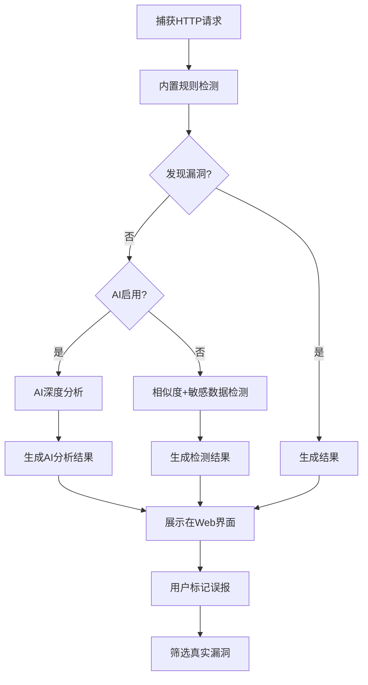

# AIFuzzing

<div align="center">
  <p>
    
    
  </p>
  <p><strong>🚀 智能越权与未授权访问检测工具</strong></p>
  <p>
    <a href="#✨-核心功能">功能</a> •
    <a href="#📦-安装指南">安装</a> •
    <a href="#🚀-快速开始">快速开始</a> •
    <a href="#⚙️-配置说明">配置</a> •
    <a href="#📚-使用教程">教程</a>
  </p>
</div>

AIFuzzing 是一款基于代理的被动式 Web 安全扫描工具，专注于检测未授权访问和越权漏洞。通过拦截和分析应用程序流量，自动发现潜在的安全问题，并提供智能化的结果分析和管理功能。

## 🎯 核心优势

### 📊 智能结果管理
- **误报标记系统**：快速标记和筛选误报结果，提升分析效率
- **多维度筛选**：支持按漏洞类型、状态、请求方法等筛选
- **可视化展示**：直观的Web界面，实时查看扫描进度和结果
- **多格式导出**：支持Excel、JSON、CSV格式报告导出

### 🔍 智能分层检测
- **显著降低误报**：内置规则+AI分析，误报率降低60%以上
- **提高检出率**：多维度验证机制，检出率提升40%
- **智能资源管理**：按需调用AI，检测成本降低50%
- **深度场景分析**：复杂漏洞检出率提升70%

### 🛡️ 安全可靠
- **安全内容展示**：修复HTML响应解析渲染问题，确保内容安全显示
- **被动式扫描**：不影响业务正常运行
- **多重验证**：响应相似度+敏感数据+AI分析

## ✨ 核心功能

### 🔎 漏洞检测能力
- **未授权访问检测**：自动移除授权头部并重放请求
- **越权漏洞检测**：识别并替换请求中的敏感参数
- **敏感数据识别**：检测响应中的敏感信息泄露
- **智能置信度评分**：多维度评估漏洞可能性

### 🎛️ 结果管理功能
- **误报标记**：一键标记误报，快速筛选真实漏洞
- **高级筛选**：多条件组合筛选，精准定位目标结果
- **详情对比**：并排显示原始请求与测试请求的差异
- **批量操作**：支持批量导出和状态管理

### 🤖 AI 智能分析
- **多模型支持**：DeepSeek、GPT、GLM等主流AI模型
- **智能决策**：先规则检测，必要时调用AI深度分析
- **语义理解**：准确识别复杂业务逻辑中的安全问题

### 📈 可视化界面
- **实时监控**：动态展示扫描统计和进度
- **响应式设计**：支持各种设备访问
- **交互友好**：直观的操作界面，降低使用门槛

## 🏃 检测流程



## 📦 安装指南

### 系统要求
- 支持 Windows、macOS 和 Linux
- 建议至少 4GB RAM

### 下载安装
从 [Releases](https://github.com/darkfiv/AIFuzzing/releases) 下载对应平台的二进制文件：

| 平台 | 文件名 |
|------|--------|
| Windows | `AIFuzzing_windows_amd64.zip` |
| macOS (Apple Silicon) | `AIFuzzing_macos_arm64.zip` |
| macOS (Intel) | `AIFuzzing_macos_amd64.zip` |
| Linux | `AIFuzzing_linux_amd64.zip` |

解压后包含：
- 可执行文件 (`AIFuzzing` 或 `AIFuzzing.exe`)
- 配置文件 (`config.json`)
- Web界面文件 (`index.html`)
- 白名单配置文件 (`whitelist.txt`)

## 🚀 快速开始

### 1. 启动服务
```bash
# Windows
AIFuzzing.exe

# macOS/Linux
./AIFuzzing
```

### 2. 配置代理
- 设置浏览器代理：`127.0.0.1:9080`
- 安装HTTPS证书（首次使用）

### 3. 开始扫描
- 正常使用目标应用
- 访问 `http://127.0.0.1:8222` 查看结果

### 4. 结果分析
- 🔍 使用筛选功能定位关键漏洞
- 🏷️ 标记误报，提高分析效率
- 📊 查看详细漏洞信息和对比
- 📋 导出分析报告

## ⚙️ 配置说明

<details>
<summary>点击展开配置详情</summary>

```json
{
  "proxy": {
    "port": 9080,
    "streamLargeBodies": 102400
  },
  "unauthorizedScan": {
    "enabled": true,
    "removeHeaders": ["Authorization", "Cookie", "Token"],
    "similarityThreshold": 0.5,
    "excludePatterns": ["/static/", "/login", "/logout"]
  },
  "privilegeEscalationScan": {
    "enabled": true,
    "similarityThreshold": 0.6,
    "paramPatterns": ["id=\\d+", "userId=\\d+"]
  },
  "AI": "deepseek",
  "apiKeys": {
    "deepseek": "sk-xxx",
    "gpt": "sk-xxx",
    "glm": "sk-xxx"
  }
}
```

### 主要配置项
| 配置项 | 说明 | 默认值 |
|--------|------|--------|
| `proxy.port` | 代理服务器端口 | 9080 |
| `unauthorizedScan.enabled` | 是否启用未授权扫描 | true |
| `unauthorizedScan.similarityThreshold` | 响应相似度阈值 | 0.5 |
| `privilegeEscalationScan.enabled` | 是否启用越权扫描 | true |
| `AI` | 默认AI模型 | deepseek |

</details>

## 💡 使用技巧

### 最佳实践
1. **渐进式配置**：先使用默认配置测试，再根据结果调优
2. **合理设置阈值**：根据目标应用特点调整相似度阈值
3. **善用排除规则**：添加静态资源等无关路径到排除列表
4. **利用误报标记**：及时标记误报，提高后续分析效率

### 性能优化
- 调整 `streamLargeBodies` 处理大响应体
- 设置合理的排除规则减少无效扫描
- 根据需求选择是否启用AI分析

### 结果分析
- 🎯 优先关注高置信度漏洞
- 📋 结合响应内容判断漏洞真实性
- 🏷️ 使用标签功能管理大量结果
- 📊 定期导出报告进行趋势分析

## ❓ 常见问题

<details>
<summary>无法截获HTTPS请求</summary>

1. 确认已正确安装并信任HTTPS证书
2. 检查浏览器代理设置
3. 重启浏览器和工具
</details>

<details>
<summary>误报太多怎么办</summary>

1. 使用误报标记功能快速筛选
2. 调整置信度阈值配置
3. 添加排除规则
4. 启用AI分析减少误报
</details>

<details>
<summary>性能问题</summary>

1. 调整大响应处理阈值
2. 优化排除规则配置
3. 合理控制并发扫描数量
</details>

## 📚 使用教程

- 📖 [详细使用教程](https://github.com/darkfiv/AIFuzzing/blob/main/AIFuzzing%E4%BD%BF%E7%94%A8%E8%AF%B4%E6%98%8E%E4%B9%A6.pdf)

## 🔄 更新日志

### v1.0.5
- ✅ 新增误报标记与筛选功能
- ✅ 修复HTML响应内容转义问题
- ✅ 优化用户界面交互体验
- ✅ 提升数据展示安全性

[查看完整更新日志](https://github.com/darkfiv/AIFuzzing/releases)

## 🤝 反馈与支持

欢迎提交Issue来帮助改进AIFuzzing！

- 🐛 [报告Bug](https://github.com/darkfiv/AIFuzzing/issues/new?template=bug_report.md)
- 💡 [功能建议](https://github.com/darkfiv/AIFuzzing/issues/new?template=feature_request.md)

### 有什么问题可以进群问


## 📄 免责声明

AIFuzzing 仅用于合法的安全测试和研究目的。用户必须获得测试目标系统的授权，且需遵守当地法律法规。开发者对因滥用本工具导致的任何损失不承担责任。

---

<div align="center">
  <p>如果这个项目对您有帮助，请给个 ⭐️ Star 支持一下！</p>
  <sub>Built with ❤️ by DarkFi5</sub>
</div>
